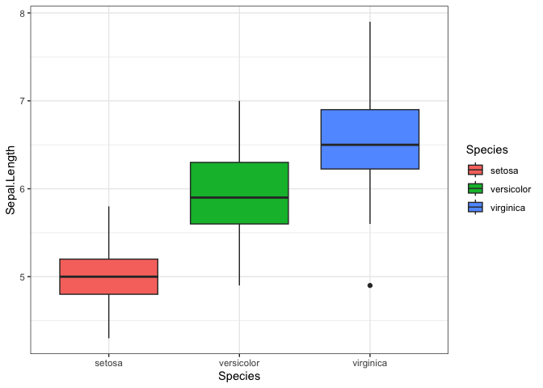

Hi everyone, 

I know some of you are curious on how to use R markdown... So, here I a giving you a basic markdown code in R rather than just the output which are those nice .html documents

Below is what R markdown gives you every time you open a new markdown document...
You may be asking... how do I open and create an R markdown in the first place? Well.... go up to File>New File>R Markdown. You'll see it a couple options below your regular R script.  I typically pick the output as an .html.

# 1. Overview of Markdown 

This is an R Markdown document. Markdown is a simple formatting syntax for authoring HTML, PDF, and MS Word documents. For more details on using R Markdown see <http://rmarkdown.rstudio.com>.

When you click the **Knit** button a document will be generated that includes both content as well as the output of any embedded R code chunks within the document. You can embed an R code chunk like this:


```r
library(tidyverse)
```

```
## ── Attaching core tidyverse packages ──────────────────────── tidyverse 2.0.0 ──
## ✔ dplyr     1.1.2     ✔ readr     2.1.4
## ✔ forcats   1.0.0     ✔ stringr   1.5.0
## ✔ ggplot2   3.4.2     ✔ tibble    3.2.1
## ✔ lubridate 1.9.2     ✔ tidyr     1.3.0
## ✔ purrr     1.0.1     
## ── Conflicts ────────────────────────────────────────── tidyverse_conflicts() ──
## ✖ dplyr::filter() masks stats::filter()
## ✖ dplyr::lag()    masks stats::lag()
## ℹ Use the conflicted package (<http://conflicted.r-lib.org/>) to force all conflicts to become errors
```

## 1.1 Markdown cookbook

This link is to the 'cookbook' for RMarkdown. It has all of the information on formatting you could possibly need. 

https://bookdown.org/yihui/rmarkdown-cookbook/


## 1.2 Just some coding examples 


```r
summary(iris)
```

```
##   Sepal.Length    Sepal.Width     Petal.Length    Petal.Width   
##  Min.   :4.300   Min.   :2.000   Min.   :1.000   Min.   :0.100  
##  1st Qu.:5.100   1st Qu.:2.800   1st Qu.:1.600   1st Qu.:0.300  
##  Median :5.800   Median :3.000   Median :4.350   Median :1.300  
##  Mean   :5.843   Mean   :3.057   Mean   :3.758   Mean   :1.199  
##  3rd Qu.:6.400   3rd Qu.:3.300   3rd Qu.:5.100   3rd Qu.:1.800  
##  Max.   :7.900   Max.   :4.400   Max.   :6.900   Max.   :2.500  
##        Species  
##  setosa    :50  
##  versicolor:50  
##  virginica :50  
##                 
##                 
## 
```

```r
str(iris)
```

```
## 'data.frame':	150 obs. of  5 variables:
##  $ Sepal.Length: num  5.1 4.9 4.7 4.6 5 5.4 4.6 5 4.4 4.9 ...
##  $ Sepal.Width : num  3.5 3 3.2 3.1 3.6 3.9 3.4 3.4 2.9 3.1 ...
##  $ Petal.Length: num  1.4 1.4 1.3 1.5 1.4 1.7 1.4 1.5 1.4 1.5 ...
##  $ Petal.Width : num  0.2 0.2 0.2 0.2 0.2 0.4 0.3 0.2 0.2 0.1 ...
##  $ Species     : Factor w/ 3 levels "setosa","versicolor",..: 1 1 1 1 1 1 1 1 1 1 ...
```

## 1.3 Including Plots

You can also embed plots, for example:

<!-- -->

Note that the `echo = FALSE` parameter was added to the code chunk to prevent printing of the R code that generated the plot.

## 1.2 Commenting 

You can have a bunch of text outside your code chunks, but you can still leave notes to yourself using the old-fashioned comment

## 1.3 Headers...

Note that when you use "#" outside of code chunks those can be used to create different levels of headers...

## Header
### Header
#### Header
##### Etc... 

## 1.4 Emphasis

**Look at that**

*Or this*

## 1.4 Tabs... Are you tabbin kidding me? {.tabset}

### This

Fill in with your dreams

### Is 

Or your research

### Crazy

What ever you please 

## {-}

# 2. A note on data organization {.tabset}

## 2.1 RProject

For all your data analysis, it is good to set up an RProject in RStudio to keep all your scripts and data in one place. This will ensure that you don't always need to set your working directory. The Project is linked to that directory. Within a project you can make folders, and it is a place to set the output of all your plots and .html. 

## 2.2 GIT(hub) yourself aquainted with github 

Github can be very confusing and difficult to put on your computer... that being said, it is super useful for a cloud workspace when you are working with other people and want to be able to track iterations and work on projects at the same time.  If you want to set up github, find some tutorials. Sometimes it is easy other times it is difficult to set up.

**Information on setting GIT up on your computer.**

https://www.freecodecamp.org/news/introduction-to-git-and-github/ 

**Information on GITHUB as a whole**

https://github.com/

# 3. Short and sweet

That is all for the R markdown alone information... 
